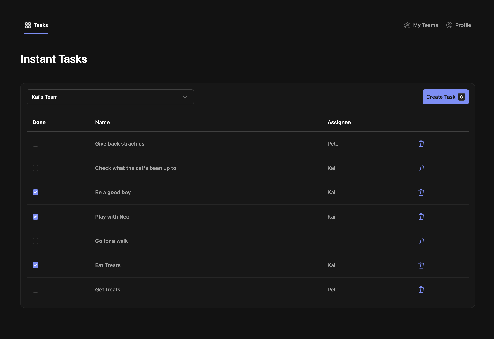
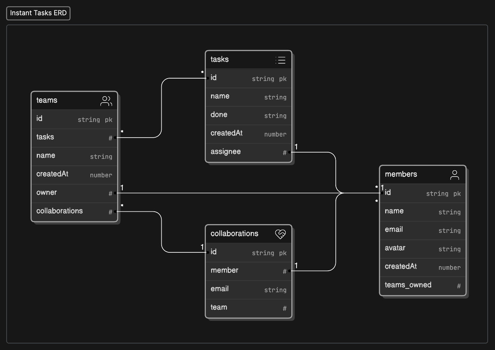

# Instant Tasks Example: Nuxt + InstantDB


This example project uses **[Nuxt](https://nuxt.com/) + [InstantDB](https://www.instantdb.com/)** to build a collaborative task management app. Users can login/register via code, create **teams**, add **collaborators** to a team and assign **tasks** to each other.




## Why? Nuxt Module in the Making

I'm wanted a better DX than vanilla.js when working with Nuxt/Vue and InstantDB. In the process of creating this project I've built a set of **Nuxt/Vue** composables, middleware, utilities and other features that might one day become a fully featured **Nuxt module.** It's very rough around the edges, but it's a start.

🚀 Current Features
- Easy Setup & Use: Initialize your database client effortlessly with `useDB`
- Reactive Queries: Use `useQuery` composable that wrapps InstantDB callback into a **ref** for live-updating data
- One-time Queries: Fetch data once with `useQueryOnce`
- Reactive Auth: The `useAuth` composable provides a reactive `user` object as-well as signin, signout, etc helpers
- Auth Middleware: `instant-auth-global` deals with redirecting users to login when not logged in (if enabled)
- Simple Configuration: Configure the client and settings in one place with `nuxt.config.ts`
- Schema as Code: Uses InstantDB's `schema as a code` to generate schema and relationships.


## 🛠️ Installation + Setup

Install dependencies

```bash
npm install
``` 

Set the APP id in your `.env` file. No need for "" here.

```env
INSTANT_APP_ID=THE_ID_OF_YOUR_INSTANT_APP
```

Serve or Build your Nuxt app
```bash
npm run dev
npm run build
```

## 🔧 Configuration

Use `nuxt.config.ts` file, to configure your InstantDB client.

```ts
// nuxt.config.ts
ssr: false, // currently, server side rendering is not supported.

runtimeConfig: {
	public: {
		// Instant Configuration
		instant: {
			appID: process.env.INSTANT_APP_ID as string, // the app id
			redirect: true, // redirect to login page if not logged in
			login: "/login", // login page route
			exclude: ["/confirm-oauth", "/404", "/public"], // these will be publicly accessible, logged in or not
			devtool: false, // show or hide instantDB devtool
		},
	},
},
```

## 📚 Usage

Currently you will need to copy/paste the composables+middleware into your project. Working on a module. Then, simply use the required composables to achieve what you need.

### Using the DB client 

```ts
// script setup
const { db, tx, id, lookup } = useDB();

function createTask(){
	db.transact(tx.tasks[id()].update({ name: "New Task" }));
}

```

See [InstantDB's docs](https://www.instantdb.com/docs/instaml) for details on the client and transactions.


### Using the reactive auth 

```ts
// script setup
const { user, sendCode, signInWithCode, signOut } = useAuth();

function sayHello(){
	console.log("Hello", user.value?.name);
}

// sendCode, signInWithCode, and signOut will return { error } – a string with the error message

```

```html
<!-- Component -->
<template>
	<div>{{ user.email }}</div>
	<UButton @click="signOut">Sign Out</UButton>
</template>
```

### Using the reactive query

```ts
// script setup
const { data, error, isLoading } = useQuery({
	teams: {		
		tasks: {},
	},
});
// data is either null or an object with the data
// error is either null or a string with the error message
// isLoading is a boolean that is true when the query is loading
```
See [InstantDB's docs](https://www.instantdb.com/docs/instaql) for details on building queries.


### Using the one-time query

```ts
// in your async function
const { data, error } = await useQueryOnce({
	teams: {
		tasks: {}
	},
});
// data is either null or an object with the data
// error is either null or a string with the error message
// isLoading is a boolean that is true when the query is loading
```

See [InstantDB's docs](https://www.instantdb.com/docs/instaql) for details on building queries.

### 🗺️ Schema as Code, Typescript and Permissions

The project comes with 3 files:
- `instant.schema.ts` – the schema as code file (this is where the database schema is defined). You can push it to your InstantDB instance with `npx instant-cli push`. Read more [here](https://www.instantdb.com/docs/schema).
- `instant.schema.types.ts` – the types file. These are currently manually written. This file gets imported by the `useDB` and `useQuery` composables which allow type safety and intellisense.
- `instant.perms.ts` – the permissions file. This is where you define the permissions for your schema. Read more [here](https://www.instantdb.com/docs/permissions).


## 🏗️ Example Project – Instant Tasks

The project is quite self-explanatory. There are index, login, profile, teams, tasks, and teams pages. The project uses [NuxtUI](https://ui.nuxt.com/) as the UI library and [TailwindCSS](https://tailwindcss.com/) for styling.

I tried to keep the code as simple as possible and document along the way. I tried to keep the data fetching and database interaction logic inside the `pages` (apart from tasks component). See `components` for more UI logic/modals, etc.

### 💿 Instant Tasks Datamodel 



The project tries to use relationships as much as possible instead of storing ids in fields. This means that you can use instantDB's [InstaQL](https://www.instantdb.com/docs/instaql) syntax to its advantage when querying.

### 🔮 Future development

- Authentication with Google
- Storage
- Other InstantDB Platform features
- Bug fixes and all else I missed
- More coffee ☕️

Peter Koraca,
2024